# Maltego Integration

## Introduction

**Maltego** is an open source intelligence \(OSINT\) and graphical link analysis tool for gathering and connecting information for investigative tasks.



It allows to transform data using external knowledge and visualize the results in a graph topology.

Transforms are small pieces of code that automatically fetch data from different sources and return the results as visual entities in the desktop client. Transforms are the central elements of Maltego which enable its users to unleash the full potential of the software whilst using a point-and-click logic to run analyses.

Netcap provides a set of entities and transformations to analyze packet capture dump files in Maltego!

The current implementation focuses on behavorial analysis of entities within the traffic dump.

## Installation

Ensure netcap **&gt;= v0.5** is installed and can be found in **$PATH**:

```text
$ net -version
v0.5
```

Ensure the **net** binary is placed in **/usr/local/bin**:

```text
$ which net
/usr/local/bin/net
```


Transformations in maltego have to specify a working directory. Currently /**usr/local** is used for this so make sure the current user has sufficient right to enter the directory. No data will be written there, all logs from transformations that invoke the netcap core are written into dedicated directories for each processed pcap file.


Next, download install the maltego transformations and enities for netcap:

Currently there are **20 entities** and **42 transformations** implemented. You can download them here:



Import them into Maltego in the "**Import / Export Config**" tab under "**Import Config**".

## Loading PCAP files into Maltego

To load a pcap file into maltego you have two options:

1\) Drag and Drop the file into a maltego graph. The files type will be **maltego.File** by default, and the path to the file on disk is set as a note on the entity.

Now, change the entities type to **netcap.PCAP**, and double click it to open the detail view. Copy the filesystem path from the **Notes** tab into the **path** property of the PCAP entity.

2\) Create a new **netcap.PCAP** entity and set the **path** property to the path of your pcap file on disk

## Running Transformations

Right click an entity and start typing **Get** into the search bar to see all available transformations for the selected type. Alternatively you can also use the **Run View** in the **Windows** tab to see and launch available transformations with a single click.

Transformations are usually bound to specific entities. For example, the **netcap.DeviceProfiles** entity, which represents the device profiles that have been derived from an input PCAP file, currently only offers the following two transformations:


**GetDeviceProfilesWithDPI** enables deep packet inspection, which requires to install dependencies and can slow down the processing drastically. When not using DPI the transformations making use of this data will simply return no results.

To add the actual devices to the graph, use the **GetDevices** transformation.


This bring the first usable entities to the graph, of type **netcap.Device**. A device has contacts and addresses it has been using to access network services by itself. When selecting a device entity, you will see the following transformations:


The generated entities will be of type **netcap.IPAddr** and contain information about the host, as well as a set of transforms to further drill down and investigate.

When selecting an entity of type **netcap.IPAddr**, the following transformations are offered:

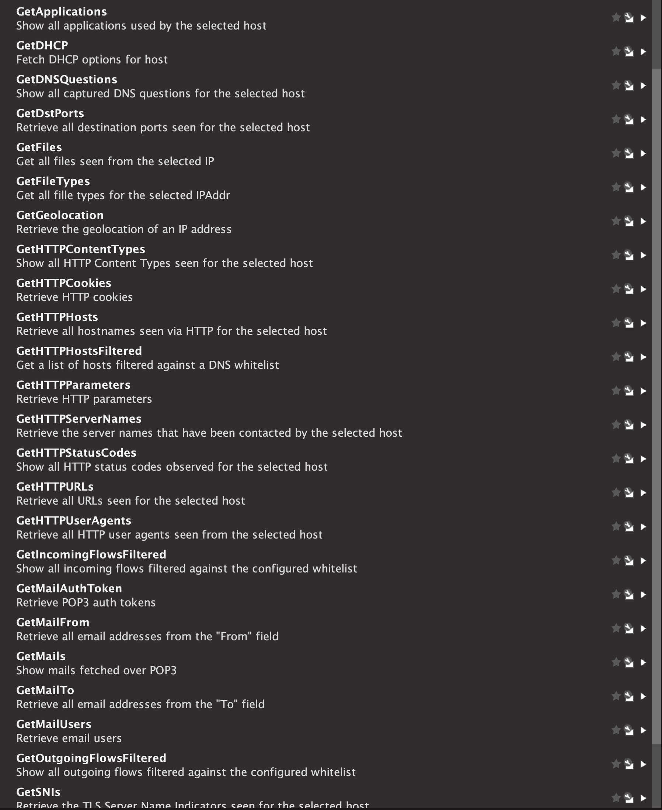

## Configuration

Netcap offers an **OpenFile** maltego transform, which will pass filetypes except for executables to the default system application for the corresponding file format. On macOS the open utility will be used for this and on the linux the default is gio open. You can override the application used for this by setting **NC\_MALTEGO\_OPEN\_FILE**.

## Examples

Search for DHCP information from the selected hosts:


Add Server Names provided as SNI on the TLS handshake:


Use Deep Packet Inspection to list all identified application categories:


Extraction of a POP3 authentication token:


## Gallery

When working with larger amount of nodes, the organic topology can be useful: 

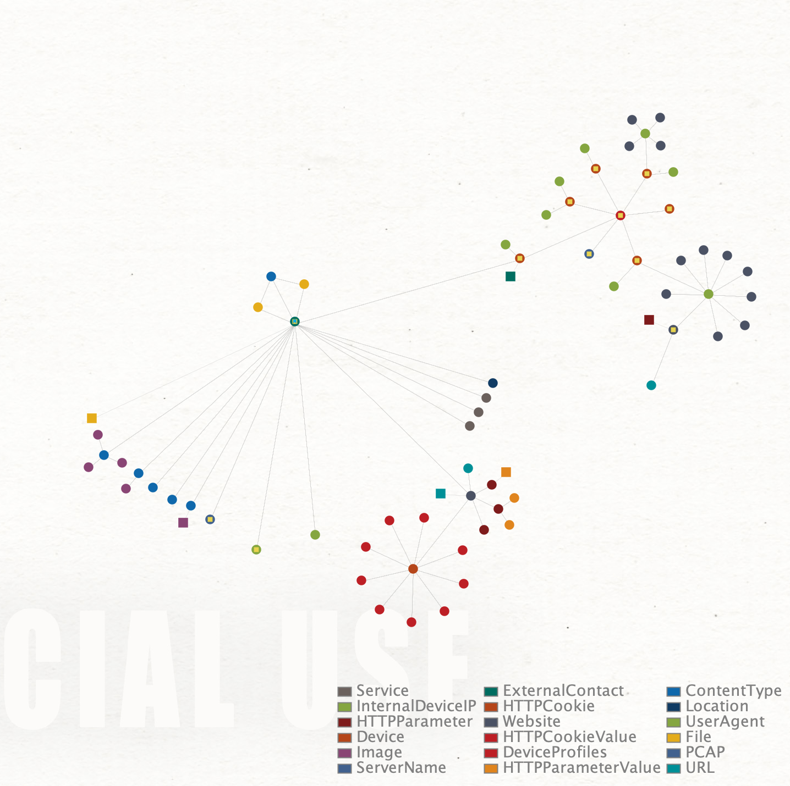

Example of interaction with a PHP webshell:

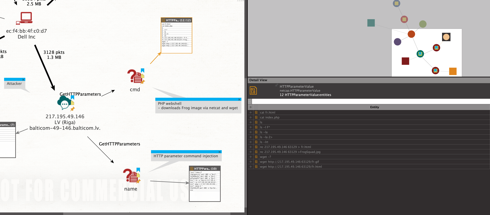

Example of an exploit abusing a HTTP parameter command injection vulnerability:


Graph during an investigation where the attacker has been identified and further information is gathered:

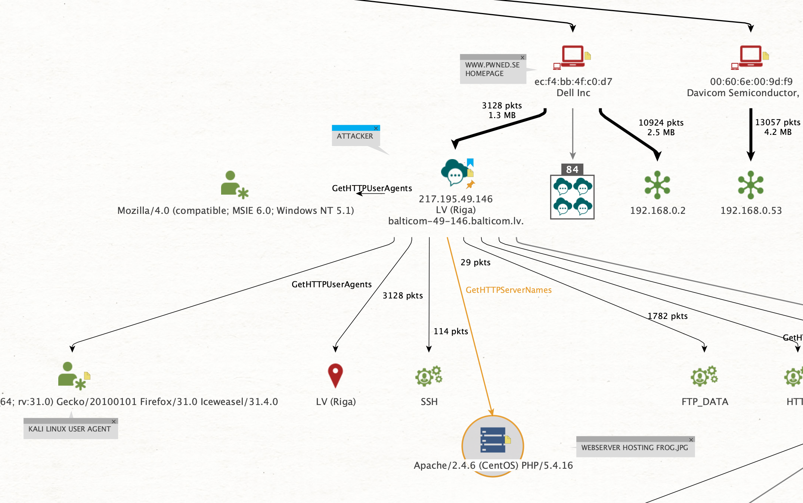

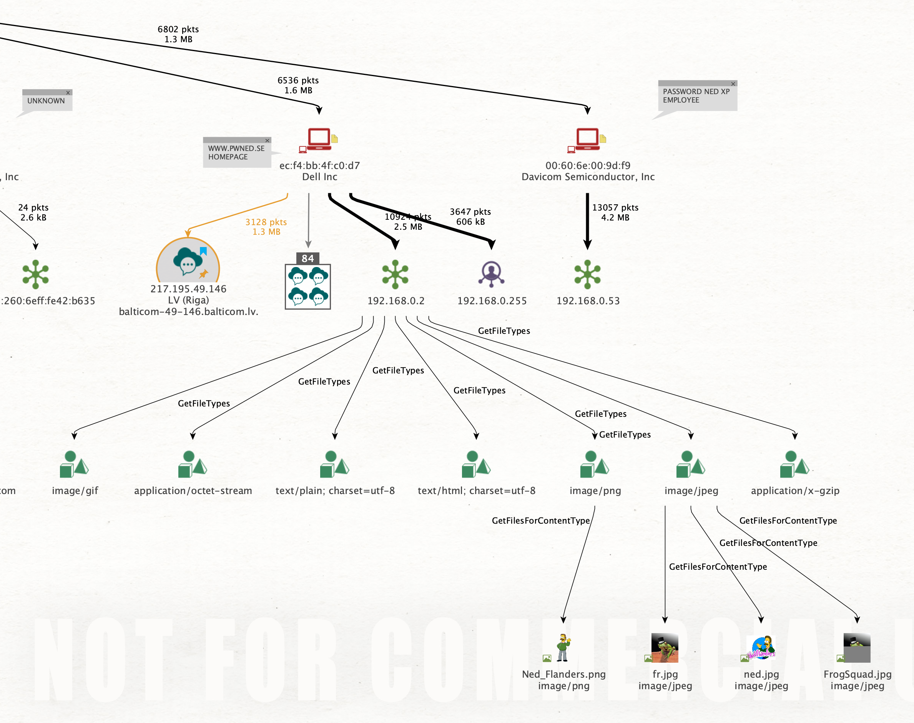


## Detail Views

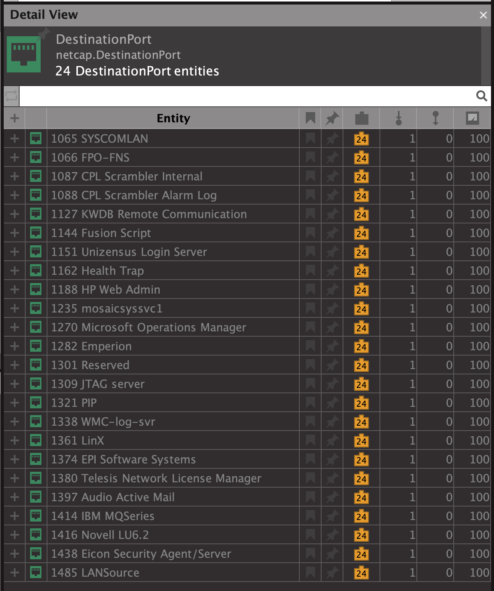

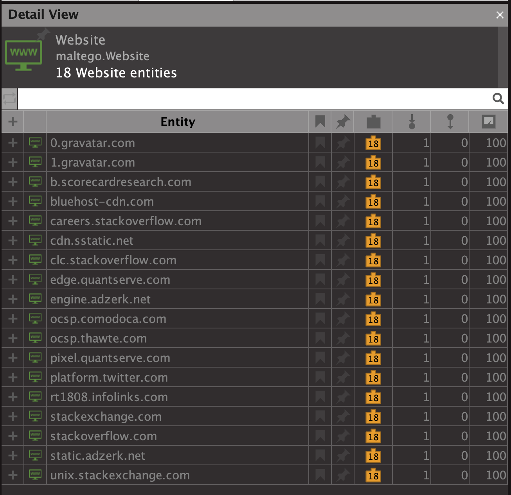

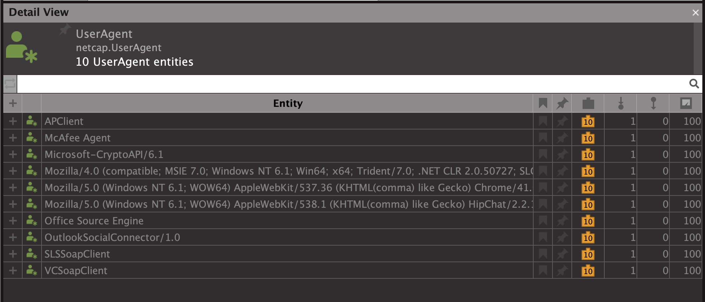

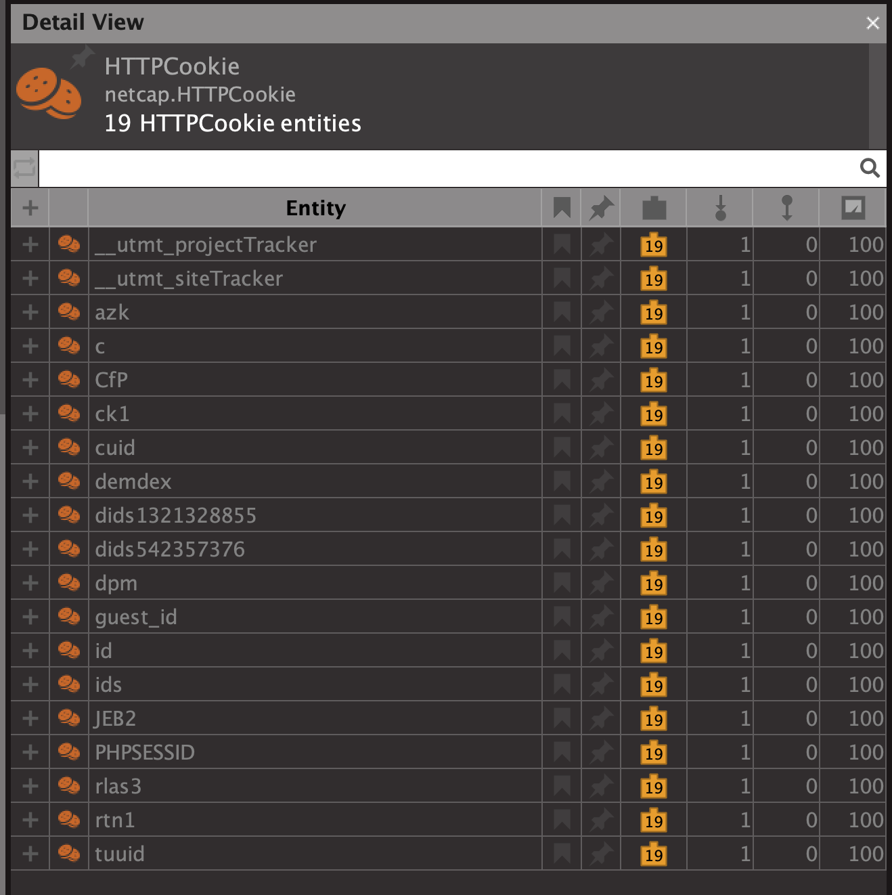

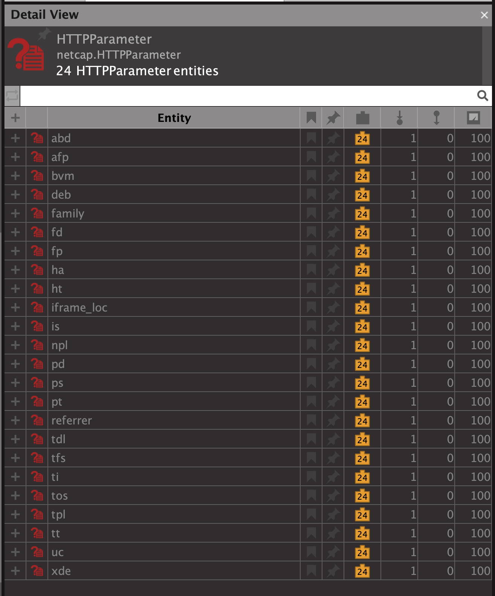

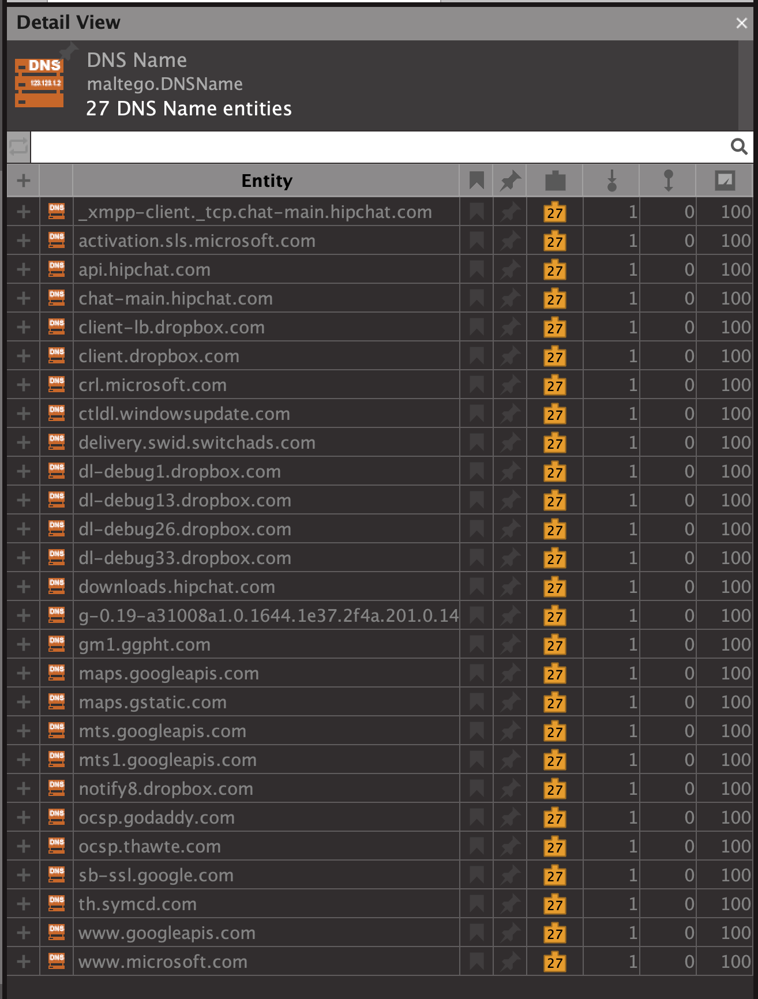

